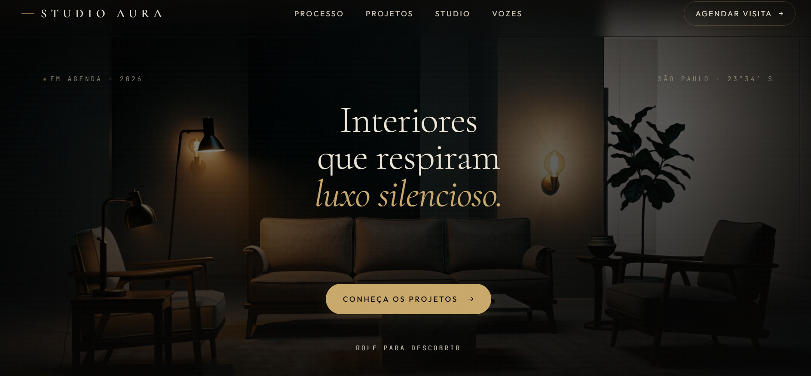

## Visual do Projeto

# Studio Aura - Landing Page de Design de Interiores

Landing page desenvolvida para um escritório de arquitetura e design de interiores, criada com foco em performance, responsividade e animações avançadas para conversão de clientes.

## Sobre o Projeto

O projeto simula a presença digital de um estúdio de design, destacando portfólio de projetos e identidade visual sofisticada. Desenvolvido para consolidação de fundamentos avançados de front-end e animações baseadas em scroll.

## Tecnologias e Ferramentas

O projeto integra bibliotecas e padrões de desenvolvimento front-end, com ênfase em animações avançadas:
- HTML5 e CSS3
- JavaScript
- GSAP (GreenSock Animation Platform):
  - Core
  - Plugins
  - ScrollTrigger
  - Utils
- Arquitetura de UI customizada (Minimalist UI e Industrial Brutalist UI)

## Estrutura do Repositório

- `index.html`: Arquivo principal contendo a estrutura e marcação da página web.
- `assets/`: Diretório de mídias e recursos visuais do projeto:
  - `arquiteta.jpeg`: Imagem de apresentação profissional.
  - `interior-dark-video.mp4` / `video-camadas.mp4`: Arquivos de vídeo para ambientação.
  - `projeto-banheiro.png`, `projeto-biblioteca.png`, `projeto-cozinha.png`, `projeto-quarto.png`, `projeto-sala.png`, `projeto-sala-2.png`, `projeto-terracota.png`, `print.png`: Portfólio visual de ambientes.
- `email-marina.txt`: Documento de briefing contendo o escopo e diretrizes do projeto solicitado pela cliente.
- `.agents/` e `.claude/`: Configurações de competências e ambiente de desenvolvimento.
- `skills-lock.json`: Arquivo de controle de dependências do ambiente.

## Acesso

O projeto está publicado e pode ser visualizado através do GitHub Pages no link:
https://barbswank.github.io/aura-design/
